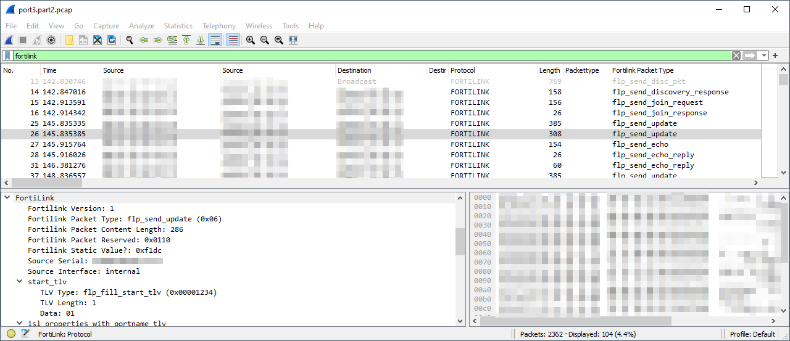

# Wireshark Lua dissectors for FortiLink (EtherType 0x88ff) and Fortinet LLDP extensions

[](LICENSE)
[](https://github.com/sanderzegers/fortilink_dissector/actions/workflows/test.yml)

Wireshark Lua dissectors for the proprietary FortiLink Ethernet protocol (`0x88ff`) and Fortinet LLDP extensions. Decode discovery, join, echo, and switch-property messages exchanged between FortiGate and FortiSwitch devices.



## Project status

**Maintenance mode.** New protocol investigation is not currently planned. Bug fixes and additional mappings supported by evidence are welcome.

Coverage is incomplete and primarily reflects the firmware combinations and traffic documented in the included captures. Other versions may introduce additional or changed fields.

## Features

- Discovery, discovery response, join request/response, echo, echo reply, and update message recognition.
- Switch information, named port properties, port roles, and speed options.
- Fortinet LLDP hostname, serial-number, and link-properties extensions.
- Length checks and diagnostics for malformed or truncated data.
- Raw display of unknown message types, TLVs, and LLDP subtypes.
- Sanitized reference captures and automated regression tests.

These dissectors cover FortiLink `0x88ff` and Fortinet LLDP extensions. They do not decode CAPWAP/DTLS, HTTPS management exchanges, or EtherType `0x88fe`.

## Installation

1. Open Wireshark.
2. Go to **Help → About Wireshark → Folders**.
3. Open the **Personal Lua Plugins** folder.
4. Copy `fortilink.lua` and `fortilink_lldp.lua` into that folder.
5. Restart Wireshark.

## Display filters

| Filter | Shows |
| --- | --- |
| `fortilink` | FortiLink protocol traffic |
| `FortiLink.packettype == 0x02` | Join requests |
| `FortiLink.join_response.status == 3` | Join responses reporting an error |
| `FortiLink.tlv_type == 0x0067` | Messages containing named port properties of type `0x0067` |
| `fllldp` | Fortinet LLDP extensions |
| `fllldp.subtype == 0x03` | LLDP link-properties extensions |
| `fllldp.auto_network == 1` | LLDP advertisements with auto-network enabled |

Field names are case-sensitive: FortiLink fields generally use `FortiLink`, while LLDP extension fields use `fllldp`.

## Reference captures

The [capture collection](pcaps/README.md) includes sanitized FortiLink discovery and authorization exchanges, plus LLDP traffic from different access-port profiles.

The FortiLink captures cover FortiOS **6.4.8** and **7.4.12**, each paired with FortiSwitchOS **7.4.9**. The capture guide documents topology, capture points, firmware versions, and anonymization.

Only LLDP and FortiLink (`0x88ff`) traffic is included.

## Protocol reference

See [docs/protocol.md](docs/protocol.md) for message types, TLV layouts, speed masks, LLDP options, and unresolved fields.

The reference distinguishes **confirmed**, **strongly observed**, **implementation-derived**, **inferred**, and **unknown** interpretations.

## Tests

The regression suite checks decoded values in the reference captures and handling of synthetic malformed, truncated, and unknown input.

With `tshark`, `text2pcap`, and `luac` installed, run:

```sh
tests/test_fortilink.sh
tests/test_fortilink_lldp.sh
```

GitHub Actions runs both scripts on pushes and pull requests.

## Disclaimer

This project is intended for protocol analysis and troubleshooting. Decoding may be incomplete or incorrect; consult the protocol reference for interpretation limits.

## License

[GNU General Public License v2.0 or later](LICENSE).
