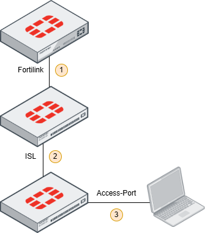

# Packet Captures

The packet captures listed below were recorded at capture points 1 and 3 in
the following diagram:

Point 1 is between the FortiGate and the first FortiSwitch.

Point 2 is the inter-switch link (ISL). No captures are currently available
for this point.

Point 3 is a regular access port on the second FortiSwitch.

The FortiGate pushes configuration using CAPWAP/DTLS and HTTPS APIs; this
traffic is not included in the captures. The captures contain only LLDP and
FortiLink packets.

Sensitive data, such as MAC addresses and serial numbers, has been replaced.
Device models, firmware versions, device-interface names, and port names were
kept because they help with packet analysis. Capture-host details, capture
interface metadata, and absolute timestamps were anonymized.

## Point 1: Between the FortiGate and FortiSwitch

`FOS6.4.8-FSW7.4.9-fortilink.pcapng`

FortiGate 300D (FortiOS 6.4.8)  
FortiSwitch 124E (FortiSwitchOS 7.4.9)

The FortiGate and FortiSwitch are connected and running, but the FortiSwitch
has not yet been authorized.

At 111 seconds, the FortiSwitch is authorized on the FortiGate to initiate the
connection.

`FOS7.4.12-FSW7.4.9-fortilink.pcapng`

FortiGate 60E (FortiOS 7.4.12)  
FortiSwitch 124E (FortiSwitchOS 7.4.9)

The FortiGate and FortiSwitch are connected and running, but the FortiSwitch
has not yet been authorized.

At 50 seconds, the FortiSwitch is authorized on the FortiGate to initiate the
connection.

## Point 2: ISL Between the FortiSwitches

No packet captures are currently available for this capture point.

## Point 3: Between the FortiSwitch and an Access-Port Host

`FSW7.4.9-Access-Port-Default-lldp-isl.pcapng`

FortiSwitch 124E (FortiSwitchOS 7.4.9)

A host is connected to a regular switch access port using the factory-default
settings. The `default-auto-isl` LLDP profile is assigned to the switch port.

`FSW7.4.9-Access-Port-Default-lldp.pcapng`

FortiSwitch 124E (FortiSwitchOS 7.4.9)

A host is connected to a regular switch access port. The LLDP profile has been
changed to `default`.
